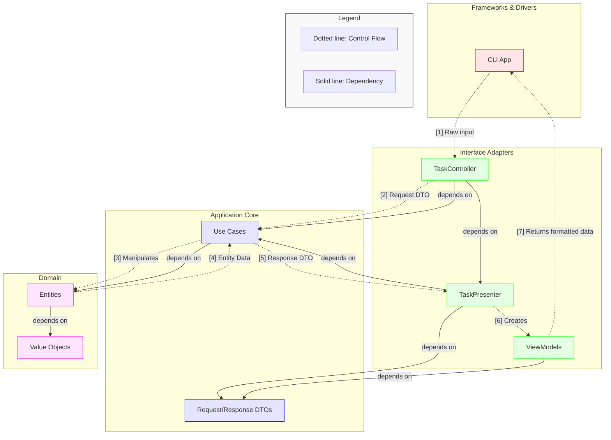
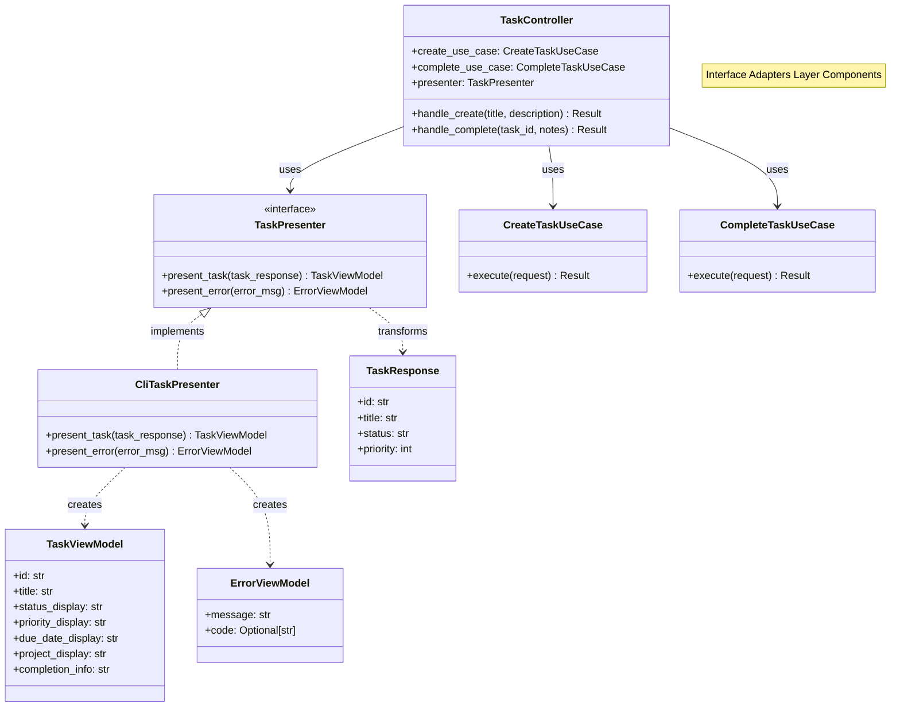
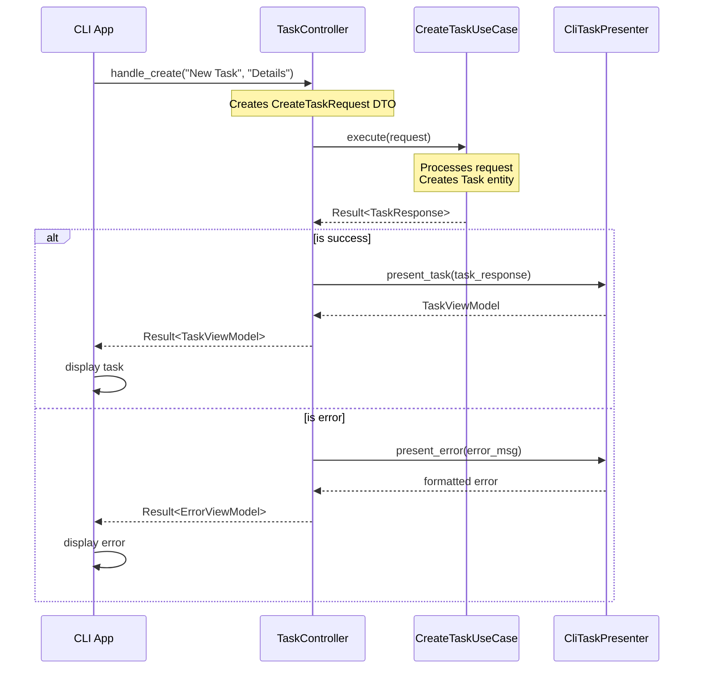

# The Interface Adapters Layer in Clean Architecture

## Overview

The Interface Adapters layer serves as a critical boundary in Clean Architecture, converting data between the formats most convenient for external agencies (UI/DB) and the formats most convenient for the inner layers (Use Cases and Entities). This document details the implementation of this layer in our Todo application.

## Clean Architecture Layers



In Clean Architecture, it's crucial to distinguish between two types of relationships:

1. **Dependencies (Solid Arrows)**
   - Show which components depend on other components at compile time
   - Must always point inward (toward domain)
   - Example: `TaskController` depends on `UseCase` interfaces
   - This is the fundamental rule of Clean Architecture - dependencies point inward

2. **Control Flow (Dotted Arrows)**
   - Show how data flows through the system at runtime
   - Can go in either direction
   - Example: Control flows from CLI → Controller → UseCase during creation
   - Then flows back out through Presenter → ViewModel for display

Let's look at a concrete example from our code:

```python
# Dependency Direction (Solid Arrow)
@dataclass
class TaskController:
    create_use_case: CreateTaskUseCase  # TaskController depends on UseCase
    presenter: TaskPresenter            # TaskController depends on Presenter

# Control Flow (Dotted Arrow)
def handle_create(self, title: str, description: str) -> Result:
    # Control flows in
    request = CreateTaskRequest(title=title, description=description)
    result = self.create_use_case.execute(request)
    
    # Control flows out
    if result.is_success:
        return self.presenter.present_task(result.value)
```

This distinction is important because:

1. **Clean Architecture's Dependency Rule** states that source code dependencies must point inward only. This means:
   - Interface Adapters can depend on Use Cases
   - Use Cases can depend on Entities
   - But Entities cannot depend on Use Cases, and Use Cases cannot depend on Interface Adapters

2. **Control Flow** often needs to go both ways to accomplish tasks:
   - Input flows inward from UI through controllers to use cases
   - Results flow outward from use cases through presenters back to UI

This is why we use techniques like:
- Dependency Injection
- Interface Segregation
- DTOs for crossing boundaries


## Components



### 1. Controllers
Controllers act as the entry point for the Interface Adapters layer, receiving input from external sources and coordinating the application's response. They can be thought of as "Use Case Routers".

#### Implementation Pattern
```python
@dataclass
class TaskController:
    create_use_case: CreateTaskUseCase
    complete_use_case: CompleteTaskUseCase
    presenter: TaskPresenter

    def handle_create(self, title: str, description: str) -> OperationResult[TaskViewModel]:
        try:
            # Convert primitive input to use case request model specifically designed for the
            # Interface->Application boundary crossing
            # It contains validation specific to application needs
            # Ensures data entering the application layer is properly formatted and validated
            request = CreateTaskRequest(title=title, description=description)
            # Execute use case and get domain-oriented result
            result = self.create_use_case.execute(request)
            if result.is_success:
                # Convert domain response to view model
                view_model = self.presenter.present_task(result.value)
                return OperationResult.succeed(view_model)
            # Handle domain errors
            error_vm = self.presenter.present_error(
                result.error.message, str(result.error.code.name)
            )
            return OperationResult.fail(error_vm.message, error_vm.code)
        except ValueError as e:
            # Handle validation errors
            error_vm = self.presenter.present_error(str(e), "VALIDATION_ERROR")
            return OperationResult.fail(error_vm.message, error_vm.code)
```

Key aspects:
- Controllers depend on use cases and presenters through constructor injection
- Transform primitive input data into DTOs for use cases
- Return Result objects that can be interpreted by any UI (View Models)
  - View Models typically contain fields of primitive types, enabling a specific 
    Presenter (ex: `CliTaskPresenter`) to format those fields as needed.

### 2. Presenters
Presenters transform use case responses into format-specific view models.

#### Base Presenter Interfaces
```python
class TaskPresenter(ABC):
    @abstractmethod
    def present_task(self, task_response: TaskResponse) -> TaskViewModel:
        pass
        
    @abstractmethod
    def present_error(self, error_msg: str, code: Optional[str] = None) -> ErrorViewModel:
        pass
```

#### Implementation Pattern
```python
class CliTaskPresenter(TaskPresenter):
    def present_task(self, task_response: TaskResponse) -> TaskViewModel:
        return TaskViewModel(
            id=task_response.id,
            title=task_response.title,
            description=task_response.description,
            status_display=f"[{task_response.status.value}]",
            priority_display=self._format_priority(task_response.priority),
            due_date_display=self._format_due_date(task_response.due_date),
            project_display=(
                f"Project: {task_response.project_id}" if task_response.project_id else ""
            ),
            completion_info=self._format_completion_info(
                task_response.completion_date, task_response.completion_notes
            ),
        )
```

Key aspects:
- Presenters implement interface defined in the Interface Adapters layer
- Transform domain-oriented responses into UI-friendly formats
- Handle formatting details specific to each interface type

### 3. View Models
View models are simple data structures that represent the final format for display.

```python
@dataclass(frozen=True)
class TaskViewModel:
    """View-specific representation of a task."""
    id: str
    title: str
    description: str
    status_display: str  # Human readable status
    priority_display: str  # Human readable priority
    # ...
```

Key aspects:
- Immutable structures (frozen=True)
- Contains pre-formatted display strings
- Independent of domain models and DTOs

## Clean Architecture Flow

1. **Input Flow**
   ```
   External Input → Controller → DTO → Use Case
   ```
   Example:
   ```python
   # CLI Input → Controller
   result = task_controller.handle_create(title="New Task", description="Details")
   
   # Controller → Use Case
   request = CreateTaskRequest(title=title, description=description)
   result = self.create_use_case.execute(request)
   ```

2. **Output Flow**
   ```
   Use Case → Response DTO → Presenter → View Model → UI
   ```
   Example:
   ```python
   # Use Case → Response DTO
   return Result.success(TaskResponse.from_entity(task))
   
   # Response → View Model
   task_vm = presenter.present_task(result.value)
   
   # View Model → UI
   print(f"{task_vm.status_display} {task_vm.title}")
   ```



## Dependency Rule Compliance

1. **Inward Dependencies**
   - Controllers depend on use case interfaces
   - Presenters depend on response DTOs
   - No dependencies on external frameworks

2. **Interface Segregation**
   - Each presenter interface is specific to a type of output
   - Controllers have focused responsibilities
   - View models are tailored to display needs

3. **Dependency Injection**
   - Use cases injected into controllers
   - Presenters injected into controllers
   - Facilitates testing and swapping implementations

## Benefits of This Implementation

1. **Separation of Concerns**
   - UI logic separated from business logic
   - Formatting separated from data processing
   - Each component has a single responsibility

2. **Flexibility**
   - Multiple UIs can use the same controllers
   - Different presenters for different output formats
   - Easy to add new interfaces

3. **Testability**
   - All components can be tested in isolation
   - Mock presenters can verify formatting
   - Mock controllers can verify UI logic

4. **Maintainability**
   - Changes to UI don't affect business logic
   - Business logic changes don't affect UI
   - Clear boundaries between responsibilities

## Example: Complete Flow

```python
# 1. External Input (CLI)
cli.create_task(title="New Task", description="Task details")

# 2. Controller Processing
class TaskController:
    def handle_create(self, title: str, description: str) -> Result:
        request = CreateTaskRequest(title=title, description=description)
        return self.create_use_case.execute(request)

# 3. Use Case Processing
# (in application layer)
result = Result.success(TaskResponse.from_entity(task))

# 4. Presenter Formatting
class CliTaskPresenter:
    def present_task(self, response: TaskResponse) -> TaskViewModel:
        return TaskViewModel(
            status_display=f"[{response.status}]",
            title=response.title,
            ...
        )

# 5. UI Display
print(f"{task_vm.status_display} {task_vm.title}")
```

## Conclusion

The Interface Adapters layer implementation successfully:
- Maintains Clean Architecture principles
- Provides clear separation between UI and business logic
- Facilitates multiple interface implementations
- Ensures testability and maintainability

This implementation allows the Todo application to support multiple interfaces (CLI, API) while keeping the core business logic clean and independent of external concerns.